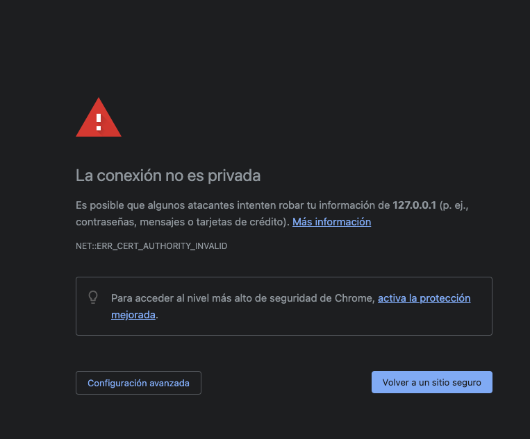
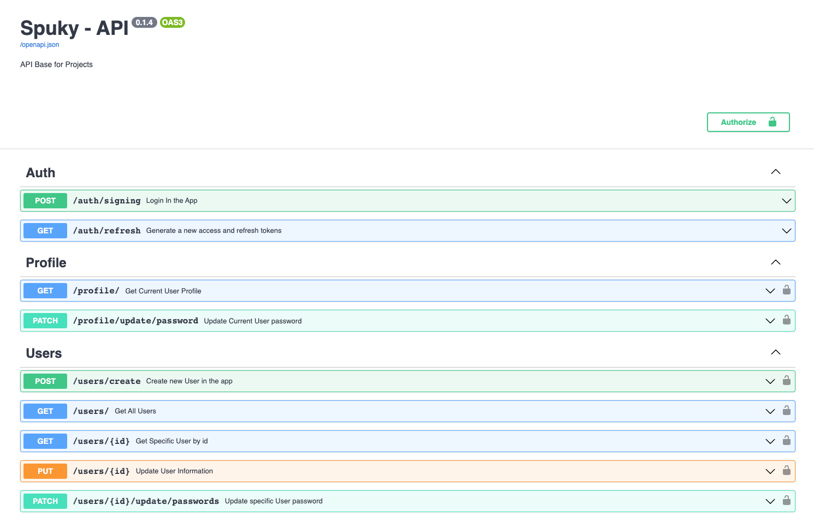

# spuky_api

Rest API utilizando FastAPI en honor a Spuky


---

## ¿Qué hace Spuky API?

Spuky API tiene como meta llevar un control de usuario basado en roles (RBAC).
En la implementación de este esquema nos dimos cuenta que FastAPI no contaba con un modulo encargado de esta accion o alguna libreria disponible. Asi que nos tomamos a la tarea de crearla.

## Features

La siguiente plantilla cuenta con:

- Script para generar primer usuario

- CRUD'S empleando Soft-Delete en todos los modulos

- JWT con los mecanismos de autenticación, autorización, y Sesion.

- MariaDB como base de datos.

- Migraciones a la base de datos con Alembic.

- Docker Compose listo y preparado, por seguridad tienes que modificar algunas variables del archivo.

- Modificable, no habrá problemas si deseas modificar el código o si deseas agregar nuevos módulos.

- SSL disponible

- Logs del backend como de la base de datos

- Código totalmente comentado

- Documentación del API utilizando Swagger, Redoc.

- Personalización de Schemas de Pydantic

- Dockerfile

---

## ¿Cómo ejecutarlo?

Se te mostrara el como podemos ejecutarlo ya sea para desarrollo en tu maquina o entornos de pruebas y producción.

### Entorno de desarrollo local

1.- Recuerda clonar el repositorio

```bash
git clone git@bitbucket.org:geckoscript/spuky_stack.git
```

---

2.- Crea un archivo `.env` con las siguientes variables. Ejemplo:

```bash
# El usuario de tu base de datos
DATABASE_USER='spuky'
# El password de tu usuario
DATABASE_PASSWORD='strongerpassword' 
# La IP de tu Base de datos
DATABASE_HOSTNAME='127.0.0.1'
# El puerto de tu Base de datos
DATABASE_PORT='3306'
# El nombre de tu Base de datos
DATABASE_NAME='spuky'
# Emplea el comando openssl rand -hex 32
secret='cac3a7fe05682e9145ac9883d244aabdb8215600558017bdf1822c0e5eb5144f'
# Para Produccion puedes dejarlas con '' y listo ya no se mostrara las documentaciones
openapi_url=/openapi.json
docs_url=/docs
redoc_url=/redoc
APP_ADMIN_USER="super_admin@spuky.com"
APP_ADMIN_PASS="StrongerPAssword"
```

No olvides **modificar** las variables de entorno

---

3.- Crea tu entorno virtual

```bash
conda create -n env python=3.9
```

`Nota: Si no usas anaconda. Utiliza otra opcion para crear tu entorno virtual xD`

Activa tu entorno virtual con:

```bash
conda activate env
```

Instala las dependencias con:

```bash
pip install -r requirements.txt
```

**Nota** Sí por alguna razón tuviste problemas al instalar las dependencias es porque:

- No creaste tu entorno virtual
- Verifica tener python 3 instalado
- Instala MariaDB o MySQL en tu equipo

---

4.-Genera tus propios certificados SSL

Se te ~~recomienda~~ `obliga` a eliminar los certificados de este repositorio y generar unos nuevos. El comando que realiza esta acción es el siguiente:

```bash

openssl req -x509 -out "${PWD}/ssl/localhost.crt" -keyout "${PWD}/ssl/localhost.key" \
-newkey rsa:2048 -nodes -days 730 -sha256 \
-subj '/CN=localhost' -extensions EXT -config <( \
       printf '[dn]\nCN=localhost\n[req]\ndistinguished_name = dn\n[EXT]\nsubjectAltName=DNS:localhost\nkeyUsage=digitalSignature\nextendedKeyUsage=serverAuth')
```

---

5.-Crea las migraciones

Este paso es sencillo lo unico que debemos hacer es ejecutar el siguiente comando:

```bash
alembic upgrade head
```

---

6.-Genera el primer usuario

Es mas sencillo de lo que crees solo tienes que:

```bash
python init_admin.py
```

o tambien si quieres crear uno personalizado usa:

```bash
python create_admin.py
```

---

7.-Ejecutalo

Llego la hora de la verdad:

```bash
uvicorn app.main:app --port 8080 --ssl-keyfile ./ssl/localhost.key --ssl-certfile ./ssl/localhost.crt --reload
```

Deberas de ingresar a <https://127.0.0.1:8080/docs> la primera vez aparece algo asi:



---

Aceptamos el riesgo y tendremos la documentación de Spuky API



Ahora podras agregar mas modulos dependiendo de tu proyecto, modificar algunas cosas que no veas necesarias y si gustas modificar mi documentación.

---

## Deployment Dockerfile

Antes de continuar este deployment es unicamente si no quieres tener un contenedor de MariaDB y quieres utilizar tu instalación local o por si el requerimiento te lo llega a pedir.

Recuerda especificar y modificar tus variables de entorno en el **DockerFile**.

```Dockerfile
# El usuario de tu base de datos
ENV DATABASE_USERNAME=spuky
# El puerto de tu base de datos
ENV DATABASE_PORT=3306
# La dirección IP de tu base de datos
ENV DATABASE_HOSTNAME=192.168.130.1
# El password de tu base de datos
ENV DATABASE_PASSWORD=strongpassword
# El nombre de tu base de datos
ENV DATABASE_NAME=spuky
# Emplea el comando openssl rand -hex 32
ENV secret='cac3a7fe05682e9145ac9883d244aabdb8215600558017bdf1822c0e5eb5144f'
# Para Produccion puedes dejarlas con '' y listo ya no se mostrara las documentaciones
ENV openapi_url='/openapi.json'
ENV docs_url='/docs'
ENV redoc_url='/redoc'
ENV APP_ADMIN_USER='super_admin@spuky.com'
ENV APP_ADMIN_PASS='SuperPassword'
```

### Construir imagen de Docker (Build)

```bash
docker build -t spuky_back .
```

### Levantar el contenedor de Docker (Run)

```bash
docker run -d --name spuky_back -p 8080:8080 spuky_back
```

### Accedemos al contenedor para ejecutar el script de la creación de otro usuario administrador [Opcional]

```bash
docker exec -ti spuky_back bash
python3 /code/create_admin.py
```

---

## Deployment Docker Compose

Este procedimiento es el que casi siempre se utiliza para **producción**.

El archivo **docker-compose.yml** tiene configurado el servicio de nuestro **backend** y el servicio de nuestra **base de datos**.

Antes de ejecutar el **docker compose** tienes que modificar las siguiente variables.

En el **docker compose** en la linea 8 hasta la 11 encontraras las variables de entorno del servicio de la **base de datos**

```Dockerfile
#Clave del usuario root de la bd
MARIADB_ROOT_PASSWORD: strongpassword
#Nombre de la base de datos
MARIADB_DATABASE: spuky
#definimos un usuario de mariadb
MARIADB_USER: spuky
#Clave del usuario de mariadb
MARIADB_PASSWORD: strongpassword2
```

De la **linea 33 a la 44** encontraras las varibles de entorno de nuestro **backend**

```Dockerfile
# El usuario de tu base de datos
DATABASE_USER:'spuky'
# El password de tu usuario
DATABASE_PASSWORD:'strongerpassword' 
#El nombre del servicio de tu base de datos declarado en el dockercompose
DATABASE_HOSTNAME:db_spuky
# El puerto de tu Base de datos
DATABASE_PORT:'3306'
# El nombre de tu Base de datos
DATABASE_NAME:'spuky'
# Emplea el comando openssl rand -hex 32
secret:'cac3a7fe05682e9145ac9883d244aabdb8215600558017bdf1822c0e5eb5144f'
# Para Produccion puedes dejarlas con '' y listo ya no se mostrara las documentaciones
openapi_url: /openapi/v1/
docs_url: /docs
redoc_url: /redoc
# email para la creacion del primer usuario
ADMIN_USER: admin@app.com
# password del primer usuario
ADMIN_PASS: strongerpassword
```

Ya que hayas modificado las variables de entorno a tu gusto lo unico que tienes que realizar son los siguientes comandos.

Creamos las imagenes

```bash
docker compose build
```

Es la hora de levantar nuestros servicios

```bash
docker compose build
```

Verfica que todo haya salido bien con

```bash
docker ps
```

Entra al contenedor

```bash
docker exec -it {id_contenedor} bash 
```

Quieres un usuario personalizado utiliza el siguiente comando:

```bash
python /code/create_admin.py
```

---

## Change Log

version 0.1.6

- Authorization
  - Se utiliza el paradigma de RBAC
- Authentication
  - Login con JWT
- Session
  - Se utiliza JWT con dos tokens, el refresh y access token
- Users
  - CRUD + Actualizar password + Softdelete
- Roles
  - CRUD + Softdelete
- Actions
  - CRUD + Softdelete
- Modules
  - CRUD + Softdelete
- Role-Permissions
  - CRUD + Softdelete
- Logs
- Enviar Logs con **Filebeat**

## Futuros Cambios

- Realizar lo mismo pero con una base de datos NoSQL
- Mejorar y optimizar el código
- Mejorar arquitectura del código
- Mejorar documentación
- Implementar Grupos
# it-chalenge-back
